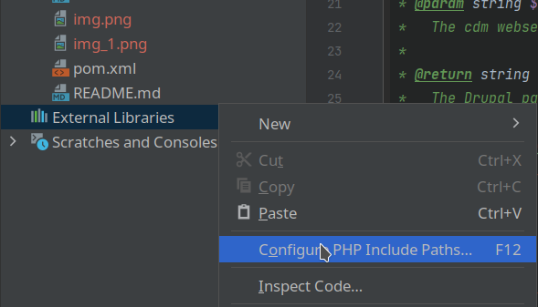
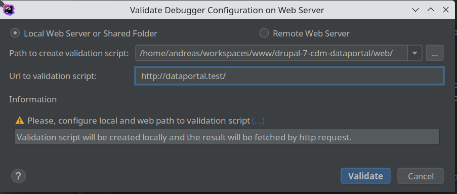

# Development of the EDIT Data Portal

*Mainly information on setting up the development environment for working with phpStorm.*

## Installing the drupal cdm_dataportal package

**NOTE**: Before starting with the installation, it is highly recommended that you read this chapter to the end. Since
the installation method for development environment differs in some details.

Follow the instructions in the [README.md](README.md) and make sure you are using the
Update - method 2](README.md##update---method-2), but respect the below recommended **2** deviations:

**1.**

For development you may want to choose different folder for installing the cdm-dataportal Drupal 7 project, 
than suggested in the [README.md](README.md). You could, for example, replace the commands given in the
[Download & extract](README.md#download--extract) chapter by:

~~~
mkdir -p ~/workspace
cd ~/workspace
wget https://cybertaxonomy.org/download/dataportal/stable/drupal-7-cdm-dataportal-5.23.0.tar.gz
~~~

... and continue in the README.md at the corresponding position.
Now, you will of course need to replace all `cd /var/www` commands by `cd ~/workspace` !!!

**2.**

In the chapter [Apache2 configuration](README.md#apache2-configuration) you will need to change the 
`/etc/apache2/sites-available/` to adapt it to the different installation folder, and you also want to enable the
`AliasMatch` directive to be able to work with multiple sites in parallel:

Assuming your user-name is `andreas` and you have installed the cdm-dataportal Drupal 7 project in `/home/andreas/workspace/`
you will need to change three lines int the apache config file to. (Last line in no longer commented!).

~~~
DocumentRoot /home/andreas/workspace/drupal-7-cdm-dataportal/web
<Directory "/home/andreas/workspace/drupal-7-cdm-dataportal/web/">
AliasMatch ^/([^/]+)(.*)		/home/andreas/workspace/drupal-7-cdm-dataportal/web/$2
~~~~

**3.**

You also need to set the file permission so that apache and phpStorm can access and write files.
If this is not set correctly, you will be bothered with problems, for example when validating the Xdebug setup below.

~~~
cd ~/workspace/drupal-7-cdm-dataportal
sudo ./scripts/admin/fix-permissions.sh --admin-user $USER --web-user www-data 
~~~

Once you have completed the installation, you might have created a new dataportal site to start with, or you have cloned
a site according to the instructions in developer wiki page 
[On migrating Data Portal sites between servers](https://dev.e-taxonomy.eu/redmine/projects/edit/wiki/CdmDataportalSiteMigration)

In case you have **problems** to get your dataportal site running please read the hints in the 
[**troubleshooting**](https://dev.e-taxonomy.eu/redmine/projects/edit/wiki/CdmDataportalSiteMigration##Troubleshooting) 
section of above linked page.

## Install Xdebug

install Xdebug:

~~~
pecl install xdebug
~~~

at the end of the install-log, pecl shows something like:

~~~
Build process completed successfully
Installing '/usr/lib/php/20151012/xdebug.so'
install ok: channel://pecl.php.net/xdebug-2.6.0
configuration option "php_ini" is not set to php.ini location
You should add "zend_extension=/usr/lib/php/20151012/xdebug.so" to php.ini
~~~

add xdebug to the `php.ini`, e.g.: `/etc/php/7.4/apache2/php.ini` Use the `xdebug.so` installation location printed out 
in by pecl.

~~~
zend_extension=/usr/lib/php/20151012/xdebug.so
xdebug.idekey=PHPSTORM
xdebug.remote_enable=1
xdebug.remote_port=9000
~~~

Note the `xdebug.remote_port` is set to `9000` to conform to the default in the *phpStorm* settings.

Restart apache  to apply the settings 

~~~
systemctl restart apache2
~~~

## PhpStorm

Start phpStorm and import the whole cdm-dataportal Drupal 7 project which is for example installed in 
`/home/andreas/workspace/drupal-7-cdm-dataportal/`

**NOTE**: Since the project contains many libraries, phpStorm will take a couple of minutes (>10 minutes) to index all code. 
Please wait until the indexing has finished.

Once phpStorm has finished the whole import task, two messages will pop up. Once about phpStorm having set the php version for 
the project to a different version than specified in the project config, and another on the Drupal support.

Click on "Enable Drupal Support" and check all options in the following dialog:

Open the "Settings" `Ctrl + Alt + S` and open *Editor > Code Style > PHP*, 
click on the torque button and choose "Import Scheme..."

and import the setting in `/ide/phpStorm/Project.xml`. Click "OK".

Open the "Settings" `Ctrl + Alt + S` and open "Directories". Click `modules/cdm_dataportal` to activate this folder and set it as "Resource Root":

Set the `vendor`, `web`, and `dist` folders as "Excluded".

**NOTE**: You might not yet have the `dist` folder yet. This is created when the project is being build and will contain
the distributable installation package. You may want to create it manually now, so that you can mark it as excluded now.

Navigate to `modules/cdm_dataportal/test/phpUnit/src/unit` activate it and set it as "Tests" folder.

The directories overview should now look like this:

After closing the "Settings" dialog your "Project" view also shows the modified folder types by coloring them like shown here:

 

Since we have exlcuded the `web` folder phpStorm can no longer see the drupal core code - this is explicitly wanted! 
To fix this we will now add the required code folders to the "External Libraries". Open the context menu or press `F12` 
to open the PHP Configuration dialog.

And add the following folders:

* `./web/includes`
* `./web/modules`
* `./web/misc`
* `./web/profiles`
* `./web/sites/all/modules/examples`
* `./web/sites/all/modules/i18n`

Finally, your PHP includes in the project view will look like 

## Configure PhpStorm to use Xdebug

Some helpful links to the official documentation:

* [jetbrains: Zero-configuration Web Application Debugging with Xdebug and PhpStorm](https://confluence.jetbrains.com/display/PhpStorm/Zero-configuration+Web+Application+Debugging+with+Xdebug+and+PhpStorm#Zero-configurationWebApplicationDebuggingwithXdebugandPhpStorm-1.InstallXdebug)
* [jetbrains: Browser Debugging Extensions](https://confluence.jetbrains.com/display/PhpStorm/Browser+Debugging+Extensions)
* [jetbrains: Troubleshooting common PHP debugging issues](https://www.jetbrains.com/help/phpstorm/troubleshooting-php-debugging.html)

To add a remote debug configuration to the localhost click on "Add Configuration...":

And add a "PHP Remote Debug" configuration:

* Set an appropriate name for the configuration like "**dataportal.test - remote debug**"
* Check "Filter debug connection by IDE key"
* enter "PHPSTORM" as "IDE key"

* and click "..." to add a "Server" configuration for the virtual host http://dataportal.test :

* Make sure "Xdebug" is selected as Debugger!
* Do not configure pathmappings for localhost!

Click "Apply" to save settings.

The "PHP Remote Debug" configuration dialog provides links to helpful information on installing Xdebug and
to validate the configuration. Click on "Validate" to make sure your setup is working correctly.

In case of problems with the debug configuration, you can also open  "Web Server Debug Validation tool" 
via the main menu:  *Run* > *Web Server Debug Validation*

In the following dialog you will need to set the `web` folder of your project (e.g.: `/home/andreas/workspaces/www/drupal-7-cdm-dataportal/web`) 
as "Path to create validation script". **IMPORTANT** independent of the actual project location, 
the path must always end with `drupal-7-cdm-dataportal/web` :  

 
### Xdebug helper browser extension

Install the Firefox extension [Xdebug helper](https://addons.mozilla.org/en-US/firefox/addon/xdebug-helper-for-firefox/)

Open the add-on settings and make sure the extension is configured to use the api-key `PHPSTORM` that 
we have set in the phpStorm debug configuration:

### Setup for developing and running PHPUnit tests

see https://github.com/cybertaxonomy/cdm-dataportal/tree/master/modules/cdm_dataportal/test/phpUnit 

