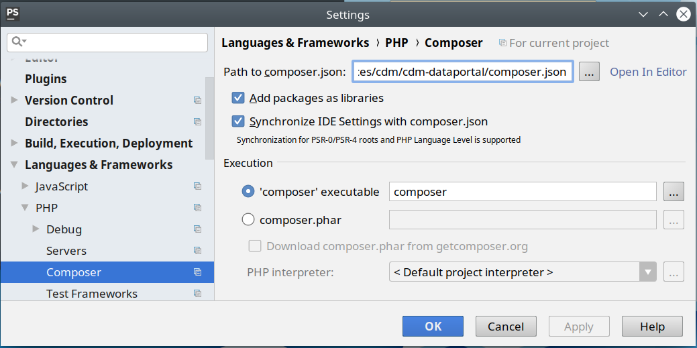
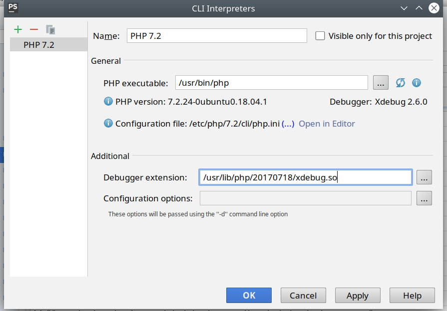
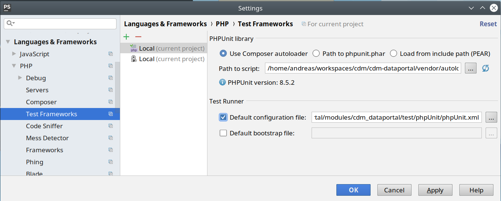

Running PHPUnit tests in PHPStorm
============================================

Author: Andreas Kohlbecker, 2012–2020

**Official PhPStorm documentation on PHPUnit tests:**

* https://www.jetbrains.com/help/phpstorm/using-phpunit-framework.html
* https://www.jetbrains.com/help/phpstorm/php-test-frameworks.html
* https://www.jetbrains.com/help/phpstorm/using-the-composer-dependency-manager.html
* https://www.jetbrains.com/help/phpstorm/php-interpreters.html

/usr/bin/php /home/andreas/workspaces/cdm/cdm-dataportal/vendor/phpunit/phpunit/phpunit --configuration /home/andreas/workspaces/cdm/cdm-dataportal/modules/cdm_dataportal/test/phpUnit/phpUnit.xml StatisticalValuesTests /home/andreas/workspaces/cdm/cdm-dataportal/modules/cdm_dataportal/test/phpUnit/src/unit/statistical_values_tests.php

Install PHPUnit
----------------------------------------------

In Debian based Linux distros PHPUnit usually can be installed by

    apt-get install phpunit

the recommended way for whowever is the installation via [Composer](https://getcomposer.org/) 
the state of the art dependency manager for PHP.

    apt-get install composer
    
The `cdm-dataportal` project contains a `composer.json` file which sets *phpunit version 8* as dependency for this project.
PHPStorm should detect this configuration file. You can check this by opening the settings page **Language&Frameworks > PHP > Composer** 
which shoould look like:
 
 

**NOTE:** You may also want to install PHP_CodeCoverage by adding the dependency to `composer.json`.

Install XDebug
----------------------------------------------

xdebug can easily be installed via pecl:

	pecl install xdebug
    
at the end of the output pecl shows:
     
    ...
    Build process completed successfully
    Installing '/usr/lib/php5/20121212/xdebug.so'
	
	
After successful installation the XDebug extension binary will be located for example in `/usr/lib/php/*/xdebug.so`.
In order to make XDebug available to the PHP CLI you need to set this location in the settings page **File > Settings > 
Languages and Frameworks > PHP** as *Debugger extension*:

Configure PHPUnit in PHPStorm
-----------------------------------------------

PHPStorm should have autodetected the PHPUnit installed via Composer already
Open the settings page **File > Settings > Languages and Frameworks > PHP > Test Frameworks** make sure the option 
"*Use Composer Autoloader*" is checked and set `modules/cdm_dataportal/test/phpUnit/phpUnit.xml` as *Default configuration file*.

Running PHPUnit tests in PHPStorm
---------------------------------------------------------------

Simply right click on a test file and choose *Run 'TestFile' (PHPUnit)* in the context menu.

Running PHPUnit tests in from the commandline
---------------------------------------------------------------

navigate into the project folder and ...

To run the test suite:

~~~
php vendor/phpunit/phpunit/phpunit --configuration modules/cdm_dataportal/test/phpUnit/phpUnit.xml
~~~

To execute a single test class
~~~
php vendor/phpunit/phpunit/phpunit --configuration modules/cdm_dataportal/test/phpUnit/phpUnit.xml modules/cdm_dataportal/test/phpUnit/src/unit/StatisticalValuesTest.php 
~~~

Running PHPUnit integration tests via the phpunitRunner.php script (DEPRECATED)
---------------------------------------------------------------

*This has only been preseved since it could be useful for running test suites from the commandline or in the CI server.*

 what we are now trying to achieve with the eclipse launcher configuration is in principle
 to run the following command:

  /usr/bin/php52/php /usr/bin/php52/phpunit --verbose --bootstrap bootstrap.php

therefore we provide the script phpunitRunner.php which will execute phpUnit.
In order to configure it properly you need to supply some environment variables.

  DRUPAL_ROOT - path to the root of your Drupal installation, that is dataportal installation.
  XDEBUG_CONFIG - must be set to 'idekey=ECLIPSE_DBGP'
  SITE_BASE_PATH - set this variable to the base path of the dataportal website you want to use for testing, eg: /flora-malesiana

Create a new php run configuration which executes phpunitRunner.php and configure the above named
environment variables in the "Environment" tab.
In the "PhpScriptArgument" tab set the following:

  	--stderr --configuration ${workspace_loc:/Drupal5/sites/all/modules/cdm_dataportal/test/phpUnit/phpUnit.conf.xml} ${workspace_loc:/Drupal5/sites/all/modules/cdm_dataportal/test/phpUnit/src/}

